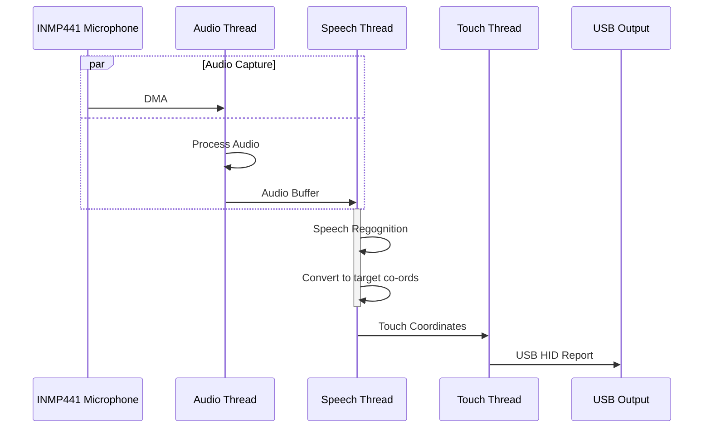

# Speech2Touch 🗣️👆

[](https://github.com/edholmes2232/Speech2Touch/actions)
[](LICENSE.md)
[](https://github.com/edholmes2232/Speech2Touch/actions)

> "Franke, I'll have a double espresso"

Speech2Touch converts voice input to touch output. Originally designed to bring Voice Control to the [Franke A600](https://www.franke.com/au/en/coffee-systems/coffee_machines/a-line/a600-fully-automatic.html) coffee machine.

Based on STM32WB55, it leverages [Picovoice](https://picovoice.ai/) to process speech, and translates it into custom USB HID packets, simulating touchscreen input.

The INMP441 MEMS microphone is used for voice input.

---

## ☕️ Demo

[](https://www.youtube.com/shorts/FJQtgSHE-vs)

---

## 📦 Getting Started

### Prerequisites
- STM32WB55 development board
- INMP441 microphone
- Franke A600 (or compatible) touchscreen device
- QT (for HIL testing)
- VSCode (for debugging)
- [STM32Cube for Visual Studio Code](https://www.st.com/content/st_com/en/stm32-mcu-developer-zone/software-development-tools/stm32cubevscode.html) extension

### 🚀 Container Build & Flash (Recommended)
Coming soon...

### 🛠️ Manual Build & Flash

1. Clone this repository.
2. Set up the project in VSCode using the STM32Cube extension.
3. Build and flash the firmware from VSCode menus.
4. Connect the device to the coffee machine via USB.

### 🧪 HIL Testing

The Hardware-In-Loop test creates a QT GUI window which emulates the position of touch targets to match the Franke A600. It utilizes Linux text-to-speech utilities to trigger the device, and tests that the correct corresponding touch target is triggered.

1. Build the QT test suite:
```
$ cmake -DCMAKE_BUILD_TYPE=Test -S Speech2Touch -B Speech2Touch/build/Test -G Ninja
$ cmake --build /home/ed/Projects/Speech2Touch/build/Test --target all --
```
2. Connect the embedded device with the latest firmware to the host PC USB port.
3. Use `dmesg` to find the `/dev/input/eventX` USB input device path.
4. Run automated test:
```
$ ./build/Test/Test/hil/runner/test_full_loop --input /dev/input/event10
```

---

## 🏗️ Architecture Overview

```
[INMP441 microphone] → [Picovoice Speech Recognition] → [STM32WB55 MCU] → [Custom USB HID] → [Touchscreen Device]
```
- **Input:** Microphone captures user speech.
- **Processing:** Picovoice library processes audio and extracts commands.
- **Translation:** Commands are mapped to touchscreen coordinates.
- **Output:** Custom USB HID packets simulate touch events on the target device.

### 🧵 Threading




---

## 🔬 HIL Testing Suite

- **QT-based GUI** replicates the Franke A600 touchscreen.
- **Automated tests** ensure voice commands map to correct on-screen buttons.
- **Continuous integration** ready.

---

## 🔮 Extending

This project is currently limited to the Franke A600. To modify it for other targets, the following files should be modified:

### Touch target files
The following files configure the available touch targets, convert these coordinates into USB HID coordinates, and then trigger the USB HID thread.
- `Core/Src/touch_targets.c`
- `Core/Inc/touch_targets.h`
- `Core/Src/touch_mapper.c`
- `Core/Inc/touch_mapper.h`

### Picovoice configuration files
The Picovoice precompiled binary at `Core/Lib/picovoice/libpicovoice.a` is pulled directly from [Picovoice/picovoice](https://github.com/Picovoice/picovoice/blob/master/sdk/mcu/lib/stm32f411/en/libpicovoice.a) repository.

The configuration files in `Core/Lib/picovoice/include` are specifically set up for a Franke A600, including using "Franke" as the wake-word. New configuration files can be generated from the [Picovoice Console](https://console.picovoice.ai/).

---

## 📜 License

MIT License. See [LICENSE.md](LICENSE) for details.
