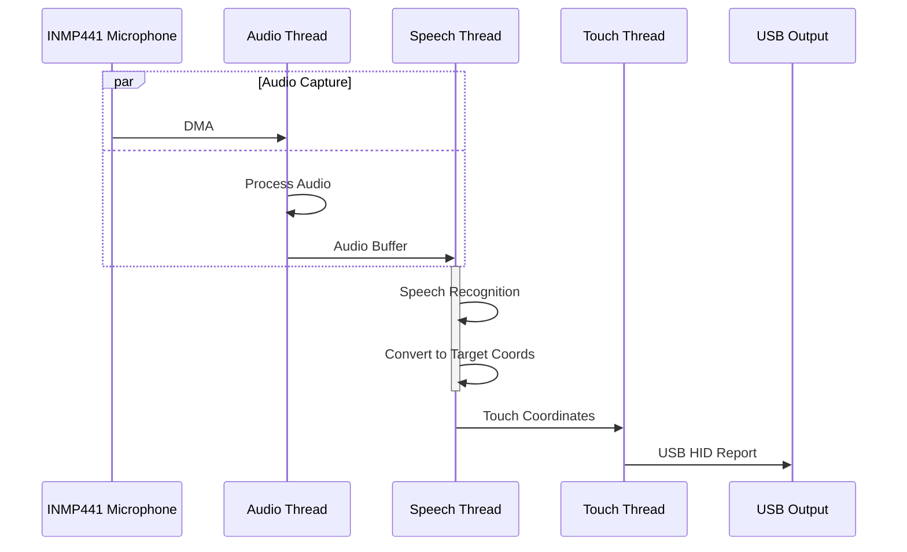

# Speech2Touch 🗣️👆

[](https://github.com/edholmes2232/Speech2Touch/actions/workflows/build-firmware.yml)
[](LICENSE.md)
[](https://github.com/edholmes2232/Speech2Touch/actions)

> "Franke, I'll have a double espresso"

Speech2Touch converts voice input to touch output. Originally designed to bring Voice Control to the [Franke A600](https://www.franke.com/au/en/coffee-systems/coffee_machines/a-line/a600-fully-automatic.html) coffee machine.

Based on STM32WB55, it leverages [Picovoice](https://picovoice.ai/) to process speech, and translates it into custom USB HID packets, simulating touchscreen input.

The INMP441 MEMS microphone is used for voice input.

**Pre-built firmware:** [Download latest](https://github.com/edholmes2232/Speech2Touch/actions/workflows/build-firmware.yml) (select latest successful run → Artifacts)

**Coverage:** This project has been written about on [Hackaday](https://hackaday.com/2025/09/24/coffee-by-command-the-speech2touch-voice-hack/) and [Hackster.io](https://www.hackster.io/news/espresso-yourself-with-your-voice-b83a2757f170).

---

## ☕️ Demo

https://github.com/user-attachments/assets/7025197e-daeb-4745-9b6d-d1ec124fa88a

---

## 🤖 Prototype Hardware

| | | |
|:---:|:---:|:---:|
|  |  |  |

The shape and orientation of the protoboard were dictated by the position of the USB ports of the Franke A600.

---

## 🏭 Hardware-In-Loop (HIL) Test

https://github.com/user-attachments/assets/d8d1ce1c-74fb-45fa-a442-dd6b9ee583c0

---

## 📦 Getting Started

### Prerequisites
- STM32WB55 USB Dongle dev board
- INMP441 microphone
- Franke A600 (or compatible) touchscreen device
- Qt (for HIL testing)
- VSCode with [STM32Cube extension](https://www.st.com/content/st_com/en/stm32-mcu-developer-zone/software-development-tools/stm32cubevscode.html)
- See `Dockerfile` for toolchain and package requirements

### 🚀 Container Build & Flash (Recommended)

1. Open in VSCode and reopen in dev container (`F1` → "Dev Containers: Reopen in Container")
2. Configure and build:
```bash
cmake -DCMAKE_BUILD_TYPE=Release \
  -DCMAKE_TOOLCHAIN_FILE=/workspaces/Speech2Touch/cmake/gcc-arm-none-eabi.cmake \
  -S /workspaces/Speech2Touch -B /workspaces/Speech2Touch/build/Release -G Ninja
cmake --build /workspaces/Speech2Touch/build/Release --target all
```
3. Flash `build/Release/Speech2Touch.bin` to your STM32WB55

### 🛠️ Manual Build & Flash

1. Clone this repository
2. Set up the project in VSCode using the STM32Cube extension
3. Build and flash the firmware from VSCode
4. Connect the device to the coffee machine via USB

### 🧪 HIL Testing

The Hardware-In-Loop test suite uses a Qt GUI to emulate the Franke A600 touchscreen layout. It leverages Linux text-to-speech utilities to trigger the device and validates that commands activate the correct touch targets.

1. Build the Qt test suite:
```bash
cmake -DCMAKE_BUILD_TYPE=Test -S Speech2Touch -B Speech2Touch/build/Test -G Ninja
cmake --build Speech2Touch/build/Test --target all
```
2. Connect the embedded device with the latest firmware to the host PC USB port
3. Use `dmesg` to identify the `/dev/input/eventX` USB input device path
4. Run the automated test:
```bash
./build/Test/Test/hil/runner/test_full_loop --input /dev/input/event10
```

---

## 🏗️ Architecture Overview

```
[INMP441 Microphone] → [Picovoice Speech Recognition] → [STM32WB55 MCU] → [Custom USB HID] → [Touchscreen Device]
```

- **Input:** INMP441 microphone captures audio
- **Processing:** Picovoice library performs speech recognition and command extraction
- **Translation:** Commands are mapped to touchscreen coordinates
- **Output:** Custom USB HID packets simulate touch events

### 🧵 Threading


```mermaid
sequenceDiagram
  participant INMP441 as INMP441 Microphone
  participant Audio as Audio Thread
  participant Speech as Speech Thread
  participant Touch as Touch Thread
  participant USB as USB Output

  par Audio Capture
    INMP441->>Audio: DMA
  and 
    Audio->>Audio: Process Audio
    Audio->>Speech: Audio Buffer
  end

  activate Speech
  Speech->>Speech: Speech Recognition
  Speech->>Speech: Convert to Target Coords
  deactivate Speech

  Speech->>Touch: Touch Coordinates
  Touch->>USB: USB HID Report
```

---

## 🔮 Extending

This project is currently limited to the Franke A600. To modify it for other targets, the following files should be modified:

### Touch target files
The following files configure the available touch targets, convert these coordinates into USB HID coordinates, and then trigger the USB HID thread.
- `Core/Src/touch_targets.c`
- `Core/Inc/touch_targets.h`
- `Core/Src/touch_mapper.c`
- `Core/Inc/touch_mapper.h`

### Picovoice configuration files
The Picovoice precompiled binary at `Core/Lib/picovoice/libpicovoice.a` is pulled directly from [Picovoice/picovoice](https://github.com/Picovoice/picovoice/blob/master/sdk/mcu/lib/stm32f411/en/libpicovoice.a) repository.

The configuration files in `Core/Lib/picovoice/include` are specifically set up for a Franke A600, including using "Franke" as the wake-word. New configuration files can be generated from the [Picovoice Console](https://console.picovoice.ai/).

---

## ☑️ Roadmap

- Replace Dev Board + Protoboard with a PCB
- Unit testing.
- Extract audio over RTT for tuning.
- Decouple Franke A600-specific functionality for easier adapting of Speech2Touch to different applications.

---

## 📜 License

MIT License. See [LICENSE.md](LICENSE) for details.
